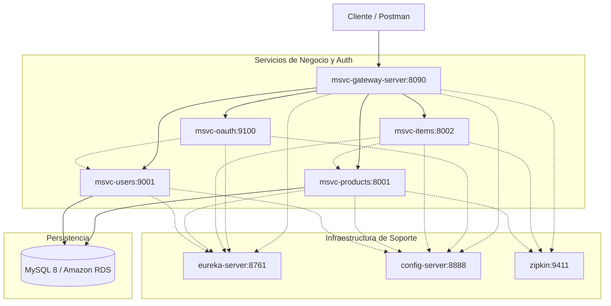

# 🚀 Distributed Microservices Platform & Cloud Deployment

Ecosistema de microservicios distribuido desarrollado con **Java 21**, **Spring Boot 3** y el ecosistema **Spring Cloud**. Diseñado bajo principios de desacoplamiento, resiliencia ante fallos, seguridad perimetral mediante OAuth2, observabilidad distribuida y despliegue contenerizado tanto en local como en la nube (**AWS**).

---

## 🛠️ Stack Tecnológico

- **Lenguaje:** Java 21+
- **Framework Base:** Spring Boot 3.x
- **Service Discovery & Registry:** Spring Cloud Netflix Eureka
- **API Gateway & Routing:** Spring Cloud Gateway
- **Centralized Configuration:** Spring Cloud Config Server (con repositorio Git desacoplado)
- **Seguridad & IAM:** Spring Security & OAuth 2.1 / OpenID Connect (msvc-oauth)
- **Comunicación Inter-Servicio:** Declarative REST Client con Spring Cloud OpenFeign
- **Balanceo & Resiliencia:** Spring Cloud LoadBalancer & Resilience4j (Circuit Breaker, TimeLimiter)
- **Trazabilidad Distribuida & Observabilidad:** Micrometer Tracing & Zipkin
- **Persistencia de Datos:** Spring Data JPA, Hibernate, MySQL 8
- **Contenerización & Cloud:** Docker, Docker Compose, Docker Hub, Amazon Web Services (EC2 & RDS)

---

## 📐 Estructura del Ecosistema
```text
spring-cloud-microservices/
├── config/                     # Repositorio local de archivos de configuración (.properties / .yml)
├── config-server/              # Spring Cloud Config Server (Distribución dinámica de perfiles)
├── eureka-server/              # Servidor de registro y descubrimiento de instancias
├── msvc-gateway-server/        # Punto de entrada unificado, enrutamiento dinámico y filtros
├── msvc-oauth/                 # Servidor de autenticación y emisión de tokens JWT (OAuth2)
├── msvc-users/                 # Microservicio de persistencia y gestión de usuarios/roles
├── msvc-products/              # Catálogo de productos con persistencia en base de datos
├── msvc-items/                 # Servicio consumidor/agregador (OpenFeign + Circuit Breakers)
├── libs-msvc-commons/          # Biblioteca compartida (Entidades comunes y DTOs)
├── zipkin/                     # Servidor de observabilidad y correlación de trazas distribuidas
├── docker-compose/             # Orquestación multicontenedor para entornos local y de producción
└── README.md
```
--- 

## 🔄 Flujo de Arquitectura

--- 

# ⚡ Decisiones Arquitectónicas Clave (ADR)

1. Configuración Externalizada y Segura: Todo el ecosistema consume perfiles (`dev, docker, prod`) centralizados desde `config-server`, desacoplando credenciales y endpoints del empaquetado JAR.

2. Resiliencia y Circuit Breaking: `msvc-items` implementa Circuit Breaker con Resilience4j sobre llamadas Feign hacia `msvc-products`, garantizando respuestas por defecto (fallback methods) si el catálogo no responde.

3. Observabilidad Distribuida: Integración de Micrometer Tracing y Zipkin para propagar identificadores de traza (`traceId, spanId`) a través del Gateway hacia los microservicios downstream, permitiendo auditar la latencia extremo a extremo.

4. Despliegue Híbrido y Desacoplamiento de Datos: Soporte para ejecución en local vía Docker Compose conectando a contenedores de MySQL, y perfiles de producción preparados para consumir instancias gestionadas en Amazon RDS ejecutándose desde instancias virtuales en Amazon EC2.

--- 

# 🚀 Despliegue Rápido (Local con Docker Compose)

**`Prerrequisitos`**
- Docker Engine >= 24.x

- Docker Compose >= 2.x

- Java 21 & Maven (para compilación local de artefactos)

### 1.`Clonar el repositorio y situarse en la infraestructura.`

Accede a la carpeta donde reside la orquestación para que Docker resuelva el archivo `docker-compose.yml` en su contexto de ejecución:
```Bash
git clone [https://github.com/cjvaldi/spring-cloud-microservices.git](https://github.com/cjvaldi/spring-cloud-microservices.git)
cd spring-cloud-microservices/docker-compose
```

### 2. `Levantar la plataforma completa en segundo plano.`

Inicia los servicios en modo desacoplado (detached con -d) para mantener la terminal libre mientras Docker descarga imágenes, inicializa redes compartidas y levanta los contenedores:

```Bash
docker compose up -d
```

### 3. `Verificar estado de los servicios.`

Comprueba los tres puntos de control esenciales del ecosistema para validar el descubrimiento, la puerta de enlace y la telemetría:

`Eureka Discovery Dashboard`: http://localhost:8761 — Confirma el registro dinámico de todos los microservicios (`MSVC-PRODUCTS, MSVC-ITEMS, MSVC-USERS`, etc.).

`Spring Cloud Gateway`: http://localhost:8090 — Puerta de entrada perimetral y punto unificado de enrutamiento hacia las APIs.

`Zipkin Tracing UI`: http://localhost:9411 — Monitorización y trazabilidad distribuida para auditar peticiones extremo a extremo.